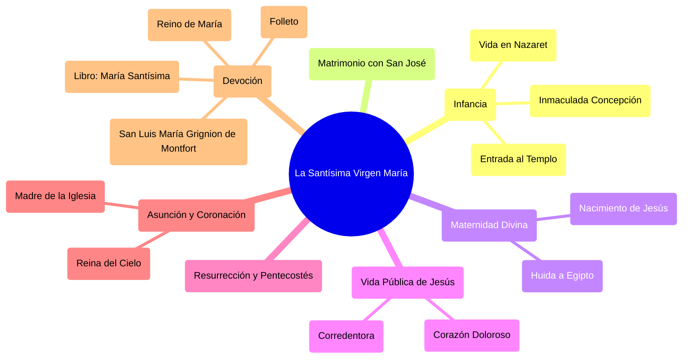

## Notas de la Conferencia:  💖🙏 Conociendo y Amando Más a la Santísima Virgen 👑💐

https://youtube.com/watch?v=f9RPbgNEEHs

**Resumen:**

Esta conferencia, parte de un homenaje a la Virgen María en el mes de mayo, busca profundizar en el conocimiento y amor a la Santísima Virgen a través de la contemplación de aspectos maravillosos, a menudo menudos, de su vida. Se destaca la importancia de conocer a María para acercarse a Jesucristo, recordando las palabras de San Luis María Grignion de Montfort sobre la necesidad de conocer a la Virgen para conocer a Jesús. Se exploran temas como la Inmaculada Concepción, la infancia de María en Nazaret, su entrada al templo, su matrimonio con San José, el nacimiento de Jesús, la huida a Egipto, la vida pública de Jesús, la pasión, la resurrección, Pentecostés, la Asunción de María y su coronación como Reina del Cielo.  Se enfatiza la maternidad de María como Corredentora y Madre de la Iglesia, y se menciona el libro "María Santísima: El Paraíso de Dios Revelado a los Hombres" de Mons. João Scognamiglio Clá Dias, EP (fundador de los Heraldos del Evangelio) como fuente de inspiración. Se invita a la audiencia a descargar un folleto con imágenes y frases del libro.

**Mapa Mental:**

## Notas de la Conferencia: 💖🙏 Conociendo y Amando Más a la Santísima Virgen 👑💐

1. **Introducción:** 🙏 Homenaje a la Virgen María en el mes de mayo. Tres programas para conocerla y amarla más.  Compartir la transmisión con amigos y familiares.
2. **Importancia de Conocer a María:**  👑 Conociendo más, amamos más, y amando más, deseamos conocer más. San Luis María Grignion de Montfort: conocer a María para conocer a Jesús. (Tratado de la Verdadera Devoción a la Santísima Virgen)
3. **Concepción Inmaculada:** 😇  María, llena de gracia desde el primer instante.  El plan original de santidad de Dios.
4. **Infancia en Nazaret:** 👧  Oración, quehaceres domésticos, vida en el jardín,  comunicación con los ángeles.  Espíritu restitutivo.
5. **Entrada al Templo:** 🕍 Voto de los padres.  Comienzo de una contrarrevolución en el templo. Simeón y Juan.
6. **Consagración Virginal:** 💐 A los 4 años, María se ofrece a Dios como esclava de la Madre del Mesías.
7. **Matrimonio con San José:** 💍 Simeón propone a San José como esposo.  Pruebas axiológicas.
8. **Nacimiento de Jesús:** 👶  Nacimiento en la Gruta de Belén.  Importancia de lo sobrenatural. Intercambio de miradas. (Libro: María Santísima: El Paraíso de Dios Revelado a los Hombres, Mons. João Scognamiglio Clá Dias, EP).
9. **Huida a Egipto:** 🐪  Obediencia de San José.  El milagro del agua. Apostolado en Egipto.
10. **Las Sandalias del Niño Jesús:** 👣 Milagro de las sandalias que se ajustan al pie de Jesús. Apostolado con el matrimonio judío.
11. **La Virgen María, Madre de Jesús y sólo de Jesús:** 🤰  Explicación de por qué María no tuvo más hijos.
12. **Vida Pública de Jesús:** 🕊  María se prepara para la Pasión.
13. **Consentimiento de María a la Pasión:**  💔 Dios pide el consentimiento de María para la Pasión. Corredentora. María, Madre de la Iglesia.
14. **Soledad de María:** 😭  El primer Viacrucis.  Encuentro con Jesús y San José después de la muerte de Jesús.
15. **Resurrección y Pentecostés:** ✨ María, consuelo de los apóstoles.  Intercesión por San Pablo.
16. **Vida de María en Éfeso:**  🏡  Acompañamiento de San Juan.  María compone en su corazón la imagen de sus devotos de los últimos tiempos.
17. **Asunción y Coronación:** 🌠  Tránsito de la Virgen.  Coronación como Reina y Madre de todo lo creado.
18. **Conclusión:** 💖  Invitación a profundizar en el amor a María.  Lectura recomendada: "María Santísima: El Paraíso de Dios Revelado a los Hombres" (Tres tomos).  Descargar el folleto disponible. (Enlace en el chat y descripción del video).  Bendición final.

